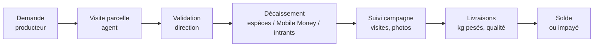
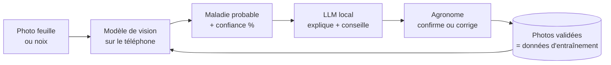
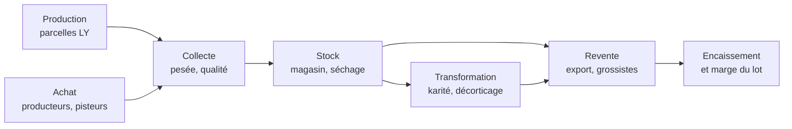
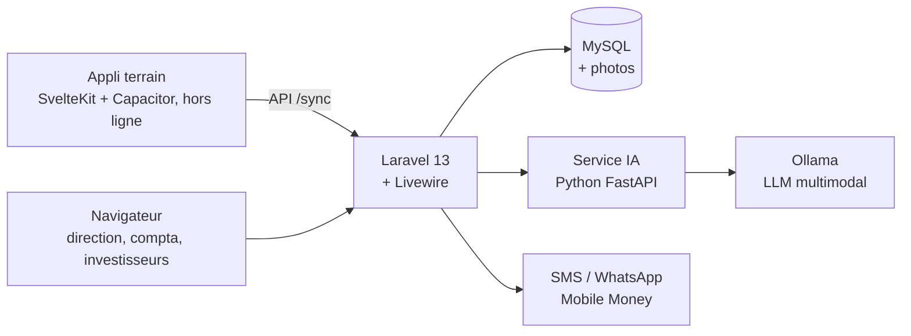

# Plateforme LY AGRICOLE — cahier des charges

Version du 2026-09-25. Copie locale du document partagé
<https://claude.ai/code/artifact/e20c4dc8-2b2f-4808-809a-da343a2a9222>.
Si les deux divergent, le document partagé (relu par le responsable projet) fait foi ;
reporter ici toute modification validée.

La plateforme suit toute l'activité de LY AGRICOLE, à chaque stade : chaque franc
prêté, dépensé ou encaissé, et chaque kilo produit, acheté, stocké ou revendu. Elle
compare les rendements pour faire progresser tout le réseau, et diagnostique les
cultures par photo avec une IA qui tourne sur nos propres machines.

---

## 1. Pourquoi cette plateforme

Le contrat de campagne autorise des avances aux producteurs (art. 9.2) : c'est le
risque n°1 de la filière, et aujourd'hui rien ne les trace. Trois besoins en découlent.

- **Savoir où va l'argent.** Exemple : 7 prêts de 3 M FCFA pour l'anacarde. Qui a reçu
  quoi, en espèces ou en intrants, et combien de kilos chacun a livré en retour.
- **Comprendre les écarts.** À prêt égal, certains producteurs rendent plus que
  d'autres. Il faut voir pourquoi (sol, âge des arbres, entretien, maladie, date de
  récolte) et diffuser ce qui marche.
- **Rendre des comptes aux investisseurs.** Le contrat prévoit un point d'étape et un
  rapport final (art. 18). La plateforme les produit à partir des données réelles.

## 2. Utilisateurs et rôles

| Rôle | Ce qu'il fait | Support |
| --- | --- | --- |
| Direction / responsable projet | Valide les prêts, fixe les prix, lit les tableaux de bord | Ordinateur |
| Agent de terrain | Enregistre producteurs et parcelles, visites, photos, achats, livraisons | Téléphone Android, **hors ligne** |
| Agronome / conseiller | Confirme les diagnostics de l'IA, tient le référentiel des traitements | Ordinateur ou téléphone |
| Comptable | Décaissements, remboursements, clôture de campagne | Ordinateur |
| Investisseur | Consulte sa quote-part, l'avancement et les rapports, en lecture seule | Navigateur |
| Producteur | Reçoit ses échéances, ses livraisons et les conseils | SMS / WhatsApp |

Beaucoup de producteurs lisent peu ou pas le français : messages très courts,
pictogrammes, et si possible message vocal dans leur langue (dioula, sénoufo…).

**Séparation des tâches** : qui saisit ne valide pas. Aucune personne seule ne crée et
n'approuve un prêt, un achat au-delà d'un seuil ou une dépense.

## 3. Module 1 — Prêts de campagne

Chaque prêt est suivi de la demande jusqu'au solde, et se rembourse en argent **ou en
kilos livrés** au prix convenu.

1. **Le prêt** : producteur, parcelle(s), culture, campagne, montant, forme (espèces,
   Mobile Money, engrais, sacs, main-d'œuvre), taux ou marge, échéance.
2. **Le décaissement** : chaque tranche datée, avec justificatif (reçu signé ou
   référence Wave / Orange Money).
3. **L'objectif de retour** : kilos attendus = montant ÷ prix de référence, et
   rendement attendu en kg/ha.
4. **Les livraisons** : poids, date, qualité (anacarde : KOR, humidité, grainage),
   prix appliqué. Chaque livraison diminue le restant dû.
5. **La clôture** : soldé, reporté sur la campagne suivante, ou perte, avec le motif.

| Indicateur | Calcul |
| --- | --- |
| Taux de remboursement | valeur livrée + espèces remboursées ÷ montant prêté |
| Rendement réel | kg livrés ÷ hectares financés |
| Écart à l'objectif | kg livrés − kg attendus |
| Coût du kilo | montant prêté ÷ kg livrés |
| Retard | jours depuis l'échéance sans livraison |

Contrôles : plafond par producteur et par hectare, double validation au-delà d'un
seuil, aucun prêt à un proche de la direction sans accord écrit (contrat art. 17.3).

## 4. Module 2 — Parcelles, pratiques et rendement

- **Parcelle** : contour GPS relevé au téléphone (surface réelle, pas déclarée),
  village, type de sol, accès à l'eau.
- **Verger d'anacarde** : âge et nombre d'arbres, densité, variété ou origine des
  plants, part d'arbres greffés.
- **Pratiques** : débroussaillage, pare-feu, taille, engrais, traitements, début de
  récolte, fréquence de ramassage, séchage.
- **Visites** : fiche courte, photos géolocalisées et datées (elles servent aussi au
  module 3).

Tableaux de bord : classement par rendement (kg/ha) et par remboursement ; carte des
parcelles colorée par rendement ; comparaison des 20 % meilleurs et des 20 % moins bons
(quelles pratiques les distinguent) ; évolution d'un producteur d'une campagne à
l'autre. Les pratiques des meilleurs deviennent des fiches conseil (module 4).

## 5. Module 3 — Diagnostic par IA locale

Un LLM seul ne suffit pas pour reconnaître une maladie sur une photo : deux modèles,
chacun pour ce qu'il fait bien, et un humain qui confirme.

1. **Modèle de vision** (MobileNet / EfficientNet / YOLO) entraîné sur nos cultures,
   sur le téléphone, hors ligne. Sous un seuil de confiance : « incertain, envoyé à
   l'agronome », jamais une devinette.
2. **LLM local** multimodal (Ollama : Qwen2.5-VL, Gemma 3…) qui rédige le conseil en
   français simple. **Il ne choisit jamais un produit ni une dose** : il reformule le
   référentiel validé (module 4).
3. **Validation humaine** de chaque diagnostic ; les photos confirmées réentraînent le
   modèle.

| Culture | Feuilles et arbres | Noix, graines, fruits |
| --- | --- | --- |
| Anacarde | anthracnose, oïdium, gommose, mineuse, rouille rouge, carences | noix immatures, moisies, piquées, trop humides |
| Tomate | mildiou, alternariose, flétrissement, virus (TYLCV), Tuta absoluta | pourriture apicale, fruits abîmés |
| Karité | à définir avec l'agronome | amandes moisies ou mal séchées |

Données de départ : jeu public « CCMT » (Ghana : anacarde, manioc, maïs, tomate) — à
confirmer (licence, qualité). Compléter par nos photos ; quelques centaines de photos
confirmées par maladie avant de faire confiance au modèle. Pour les noix, rien
d'existant : jeu à construire par LY.

## 6. Module 4 — Conseil et traitements

Les recommandations viennent d'un référentiel tenu par un agronome, jamais de l'IA
seule. Ordre de proposition :

1. **Pratiques sans produit** : taille sanitaire, ramassage et brûlage des feuilles
   atteintes, espacement, rotation, désherbage.
2. **Solutions biologiques ou peu toxiques** : neem, pièges à phéromones, Bacillus,
   cuivre à dose raisonnée, selon le cas.
3. **Produits chimiques homologués en Côte d'Ivoire**, si nécessaire : matière active,
   toxicité humaine, dose, nombre de passages, **délai avant récolte**, protection
   obligatoire, effet sur les abeilles (floraison de l'anacarde), coût/ha.

Signalements automatiques : produit interdit ou retiré ; alternative moins toxique à
efficacité comparable ; traitement trop proche de la récolte ; producteur qui traite
beaucoup plus que la moyenne. Chaque traitement appliqué est tracé sur la parcelle.

## 7. Module 5 — Chaîne complète : achats, stock, reventes

Chaque kilo est suivi par **lot**, du producteur à l'acheteur final ; chaque lot porte
ses coûts, d'où une marge réelle par lot et par stade.

| Stade | Ce qui est enregistré | Coûts rattachés au lot |
| --- | --- | --- |
| Production propre | Récolte par parcelle, main-d'œuvre, intrants | Intrants, journaliers, carburant |
| Achat | Fournisseur (producteur sous prêt ou non, coopérative, pisteur), poids, qualité, prix, paiement, bon d'achat signé | Prix d'achat, commission pisteur, sacs |
| Collecte et transport | Point de collecte, véhicule, trajet, poids départ / arrivée | Carburant, location camion, chargement, frais de route |
| Stock | Magasin, emplacement, entrée, humidité, pertes | Loyer, gardiennage, traitement du stock |
| Transformation | Matière entrée, produit sorti, rendement, sous-produits | Énergie, main-d'œuvre, emballages |
| Revente | Acheteur, contrat, prix, quantité, qualité acceptée, facture | Taxes et redevances, frais d'export, commission |
| Encaissement | Paiements reçus, impayés, relances | — |

Contrôles : écart de poids achat / entrée en stock / revente au-delà d'un seuil (motif
obligatoire) ; stock théorique contre stock compté ; prix d'achat hors fourchette du
prix officiel ; lot vendu à perte ou stock qui vieillit.

## 8. Module 6 — Dépenses, trésorerie et comptabilité

Toute sortie d'argent passe par la plateforme avec son justificatif, rattachée à une
campagne et, si possible, à un lot, une parcelle ou un prêt.

- **Dépenses** : catégorie, montant, date, bénéficiaire, photo du reçu, rattachement ;
  validation au-delà d'un seuil ; dépenses exclues par le contrat (art. 10.3) bloquées
  sur les fonds de campagne.
- **Comptes de trésorerie** : caisses des agents, banque, Wave, Orange Money, MTN MoMo ;
  mouvements entre comptes tracés ; soldes en temps réel.
- **Avances aux agents** pour acheter sur le terrain, justifiées par les bons d'achat.
- **Rapprochement** des relevés bancaires et Mobile Money.
- **Budget** par campagne et par poste, prévu contre réel.
- **Salaires et journaliers** : pointage, paie, avances.
- **Comptabilité** : écriture générée au plan SYSCOHADA révisé ; export pour le cabinet ;
  grand livre, balance, résultat par campagne. Facturation électronique ivoirienne : à
  vérifier avec le comptable.

Documents PDF : bons d'achat, bons de livraison, factures, reçus de remboursement, état
de caisse, rapport de campagne investisseurs — envoyables par WhatsApp.

## 9. Autres modules

| Module | Contenu |
| --- | --- |
| Campagnes et investisseurs | Fonds collectés, apport de LY, affectation des dépenses, résultat et quotes-parts (contrat art. 10 à 14), rapports PDF |
| Stock d'intrants | Engrais, sacs, bâches distribués à crédit (prêts en nature) |
| Alertes | Météo (pluie au séchage, feux de brousse), échéances, maladie dans une zone — SMS / WhatsApp |
| Prix du marché | Prix officiel bord-champ de l'anacarde par campagne, prix constatés |
| Calendrier cultural | Qui fait quoi et quand, par culture |
| Journal d'activité | Qui a créé, modifié ou validé quoi et quand — rien ne s'efface |

## 10. Compléments proposés après analyse

| Ajout | Pourquoi | Phase |
| --- | --- | --- |
| **Confirmation SMS au producteur** de chaque paiement, livraison, remboursement | Meilleure protection contre un poids gonflé ou de l'argent retenu par un agent | 1 |
| **Carte producteur à QR code** (photo, pièce d'identité, numéro Mobile Money) | Identification en une seconde, pas de doublons ni de prête-noms | 1 |
| **Séparation des tâches** | Personne ne crée et n'approuve seul | 1 |
| **Stock d'intrants** distribués à crédit | Beaucoup de prêts seront en nature | 1 |
| **Consentement et données personnelles** (loi 2013-450, ARTCI) | Identités, GPS, téléphones collectés | 1 |
| **Note de fiabilité du producteur** | Propose un plafond pour la campagne suivante ; la direction décide | 2 |
| **Groupes et caution solidaire** | Baisse des impayés | 2 |
| **Warrantage** (stock mis en gage) | Sécurise les fonds (faiblesse du contrat, art. 5) | 2 |
| **Balance Bluetooth** au point de collecte | Poids sans saisie manuelle | 2 |
| **Véhicules et matériel** | Transport = gros poste de coût | 2 |
| **Ventes export en devises** | Marge dépendante du taux d'encaissement | 2 |
| **Indicateurs d'impact** (emplois, femmes, jeunes, rendements) | Mission de LY ; demandé par bailleurs et banques | 2 |
| **Site vitrine intégré** (cahier déjà écrit) | Une seule application ; devis vers le module ventes | 2 |
| **Images satellite Sentinel-2** | Vigueur des parcelles sans visite | 4 |
| **Déclarations à la filière** (Conseil du Coton et de l'Anacarde) | Obligations de l'acheteur agréé à vérifier | à confirmer |

L'application est conçue pour LY seule ; la proposer à d'autres coopératives
demanderait la séparation entre entreprises (non prévu en phase 1).

## 11. Architecture technique

Voir `docs/DECISIONS.md` pour le détail et les raisons.

Matériel pour le LLM local : carte graphique 12 à 16 Go (RTX 3060 12 Go, 4060 Ti 16 Go)
pour un modèle multimodal de 7 à 8 milliards de paramètres ; sans carte graphique,
compter des dizaines de secondes par réponse. Onduleur indispensable.

## 12. Phasage

La campagne du contrat démarre le **21 décembre 2026**.

| Phase | Contenu | Prêt pour |
| --- | --- | --- |
| 1 | Producteurs, parcelles GPS, prêts et remboursements, intrants, achats bord-champ, stock par lot, dépenses et justificatifs, caisses et Mobile Money, confirmation SMS, appli terrain hors ligne | Début de campagne, décembre 2026 |
| 2 | Reventes et encaissements, marge par lot, visites et photos, comparaison des rendements, portail investisseurs, rapports PDF du contrat, budget, note de fiabilité, site vitrine | Point d'étape de la campagne |
| 3 | Comptabilité SYSCOHADA et rapprochements, paie des journaliers, référentiel des traitements, diagnostic IA en « assistant », WhatsApp | Pendant la campagne 2026-2027 |
| 4 | Diagnostic hors ligne sur téléphone, qualité des noix par photo, transformation, satellite | Campagne 2027-2028 |

Détail semaine par semaine : `docs/PLAN_IMPLEMENTATION.md`.
Questions en attente : `docs/QUESTIONS_OUVERTES.md`.
