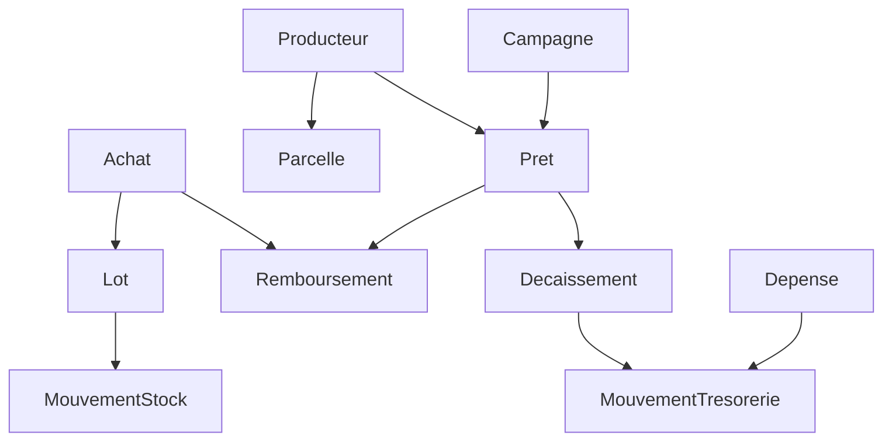

# Modèle de données — phase 1

Projet de schéma à valider pendant la semaine 1. Conventions : `docs/DECISIONS.md`
(D3 UUID, D4 FCFA entiers et grammes, D5 registres immuables, D8 noms français).

Légende : 📱 = créable hors ligne sur l'appli terrain (clé UUID v7 fournie par le
téléphone) · 🔒 = registre immuable (jamais `UPDATE` ni `DELETE`, correction par
contre-passation).

## Référentiels

| Table | Colonnes principales | Remarques |
| --- | --- | --- |
| `users` | nom, telephone, email, role, actif | rôles : `direction`, `agent`, `agronome`, `comptable`, `investisseur`, `admin` ; `role` vide = aucun droit ; pas de suppression, on désactive |
| `zones` | nom, actif | région / département de collecte |
| `villages` | zone_id, nom, lat, lng, actif | nom unique par zone ; lat/lng en `DECIMAL(10,7)` |
| `produits` | code (`anacarde`, `karite`, `tomate`…), nom, actif | pas de colonne `unite` : tout se pèse, en grammes (D4) — modifié le 2026-09-28 |
| `campagnes` | code (`2026-2027`), produit_id, debut, fin, statut, prix_officiel_kg_fcfa | statut : `preparation`, `ouverte`, `cloturee` ; code unique par produit ; **une seule ouverte par produit** ; prix vide tant que non annoncé |
| `magasins` | nom, village_id, capacite_g, actif | capacité en **grammes** (D4), saisie en kg — remplace `capacite_kg` le 2026-09-28 |
| `points_collecte` | nom, village_id, actif | nom unique par village |

## Producteurs et parcelles

| Table | Colonnes principales | Remarques |
| --- | --- | --- |
| `producteurs` 📱 | id (UUID v7), code (carte QR), nom, prenoms, sexe, annee_naissance, telephone, numero_mobile_money, operateur_mm, piece_type, piece_numero, photo, village_id, groupe_id, consentement_at, consentement_par, cree_par, actif | `code` = `LYP-000001`, attribué par le **serveur** (table `compteurs`), jamais par le téléphone ; le QR ne contient que lui. Téléphones stockés en 10 chiffres. Pièce identique = **refus** (index unique) ; téléphone / Mobile Money identique = **alerte à confirmer**, confirmation journalisée (`doublon_confirme`). Pas de fiche sans consentement. Photo sur le disque **privé**. |
| `compteurs` | nom, valeur | numéros lisibles attribués par le serveur, sous verrou de ligne ; pas de trou si la création échoue |
| `groupes_producteurs` | nom, village_id, responsable_id, actif | nom unique par village ; responsable = producteur du village |
| `parcelles` 📱 | id (UUID v7), producteur_id, nom, contour, surface_m2 (calculée), produit_id, annee_plantation, nb_arbres, sol, acces_eau, cree_par, actif | `contour` = géométrie GeoJSON (Polygon/MultiPolygon, WGS84) ; `surface_m2` recalculée par le modèle à chaque changement de contour, **non affectable** ; sans contour : vide (« non relevée »). Culture = `produit_id` (au lieu de `culture` texte). |

## Prêts

| Table | Colonnes principales | Remarques |
| --- | --- | --- |
| `prets` | id (UUID v7), reference (`LYPR-000001`), producteur_id, campagne_id, montant_fcfa, forme (`especes`, `mobile_money` ; `intrants`, `mixte` en semaine 5), prix_reference_kg_fcfa, grammes_attendus, echeance, statut, **validations_requises**, **partie_liee**, **accord_ecrit**, motif_refus, cree_par, valide_at, motif_cloture | statut aujourd'hui : `demande`, `valide`, `refuse`, `decaisse` (les autres avec les remboursements) ; `valide_par` remplacé par la table `validations_pret` (2026-10-17) ; pas d'intérêt (question 4) ; kilos attendus = **estimation** au prix de référence (question 3) |
| `validations_pret` 🔒 | pret_id, user_id, created_at | une ligne par validation ; unique (prêt, personne) ; aucune par l'auteur ; 2 au-dessus du seuil **ou si le seuil n'est pas défini**, 1 sinon |
| `pret_parcelle` | pret_id, parcelle_id | hectares financés = somme des surfaces relevées ; plafond par hectare vérifié sur elles |
| `decaissements` 🔒 | pret_id, montant_fcfa, mode, reference_paiement, compte_id, date_decaissement, justificatif, mouvement_id, cree_par | chaque tranche = une sortie de trésorerie (nature `decaissement_pret`) ; Σ tranches non contre-passées ≤ montant ; espèces : caisse + reçu signé ; Mobile Money : compte Mobile Money + référence |
| `remboursements` 🔒 | pret_id, type (`especes`, `nature`), montant_fcfa, achat_id (si nature), mouvement_tresorerie_id (si espèces), date, annule_id | restant dû = montant − somme des remboursements |

## Intrants

| Table | Colonnes principales | Remarques |
| --- | --- | --- |
| `intrants` | nom, unite, prix_unitaire_fcfa | engrais, sacs, bâches |
| `mouvements_intrants` 🔒 | intrant_id, magasin_id, type (`entree`, `distribution`, `perte`, `ajustement`), quantite, pret_id, date, annule_id | une distribution à crédit alimente le prêt en nature |

## Achats et stock

| Table | Colonnes principales | Remarques |
| --- | --- | --- |
| `achats` 📱 | uuid, reference, campagne_id, produit_id, fournisseur_type (`producteur`, `pisteur`, `cooperative`), producteur_id, fournisseur_nom, point_collecte_id, agent_id, date_heure, lat, lng, poids_brut_g, tare_g, poids_net_g, humidite_pour_mille, kor_centieme_lbs, grainage_noix_kg, prix_kg_fcfa, montant_fcfa, mode_paiement, pret_id, lot_id, photo_pesee, statut | un achat lié à un prêt génère un remboursement en nature |
| `pisteurs` | nom, telephone, taux_commission | |
| `lots` | code, produit_id, campagne_id, magasin_id, statut, cree_at | statut : `ouvert`, `en_stock`, `vendu`, `transforme` |
| `mouvements_stock` 🔒 | lot_id, magasin_id, type (`entree_achat`, `transfert_sortie`, `transfert_entree`, `perte`, `ajustement_inventaire`, `sortie_vente`), grammes (signé), date, motif, achat_id, annule_id, cree_par | stock d'un lot = somme des grammes |
| `inventaires` | magasin_id, date, compte_par, valide_par | lignes : lot_id, grammes_comptes, ecart |

## Trésorerie et dépenses

| Table | Colonnes principales | Remarques |
| --- | --- | --- |
| `comptes_tresorerie` | nom, type (`caisse`, `banque`, `wave`, `orange_money`, `mtn_momo`, `moov_money`), titulaire_id (caisse d'agent), campagne_id (compte dédié, art. 5), actif | **pas de colonne solde** |
| `mouvements_tresorerie` 🔒 | compte_id, sens (`entree`, `sortie`), montant_fcfa, nature, date_operation, libelle, reference_externe, lien, source_type, source_id, annule_id (unique), motif, cree_par | solde = somme ; virement = deux mouvements de même `lien` ; écrits **seulement** par `App\Services\Tresorerie` (verrou du compte, jamais de solde négatif) ; contre-passation d'un virement = ses deux jambes |
| `categories_depense` | nom, code_syscohada, exclue_fonds_campagne, actif | art. 10.3 du contrat : refusée sur un compte de campagne et sur une dépense rattachée à une campagne |
| `depenses` 📱 | id (UUID v7), categorie_id, compte_id, montant_fcfa, date_depense, beneficiaire, description, justificatif (disque privé, obligatoire), campagne_id, parcelle_id, statut (`a_valider`, `payee`, `refusee`, `annulee`), cree_par, valide_par, valide_at, motif_refus, mouvement_id | au-dessus du seuil — **ou seuil non défini** — validation par une autre personne, l'argent sort à la validation ; `lot_id`, `pret_id` viendront avec leurs tables |
| ~~`avances_agents`~~ | — | **remplacée (2026-10-10)** : une avance est un virement de nature `avance_agent` vers la caisse de l'agent (compte avec titulaire) ; le **reste à justifier est le solde de sa caisse**, sans table à tenir d'accord |

## Transverse

| Table | Colonnes principales | Remarques |
| --- | --- | --- |
| `confirmations_sms` | producteur_id, objet_type, objet_id, message, envoye_at, statut, reponse | preuve envoyée au producteur |
| `journal_activite` 🔒 | user_id, action, objet_type, objet_id, avant, apres, ip, appareil, at | qui a fait quoi |
| `synchronisations` | appareil_id, user_id, recu_at, nb_operations, nb_rejetees, erreurs | trace des envois de l'appli terrain |
| `parametres` | cle, valeur | clés connues du code (`App\Enums\CleParametre`) ; **pas de valeur par défaut** : non défini ≠ 0, le code applique la règle prudente |

## Invariants à tester dès la semaine où la table naît

1. Restant dû d'un prêt = `montant_fcfa − Σ remboursements` et n'est jamais négatif
   (un trop-perçu devient un crédit producteur explicite, pas un nombre négatif).
2. Stock d'un lot = `Σ mouvements_stock.grammes` ≥ 0.
3. Solde d'un compte = `Σ entrées − Σ sorties` ; une caisse ne passe jamais en négatif.
4. Un achat enregistré deux fois avec le même UUID = un seul achat.
5. `valide_par ≠ cree_par` sur tout ce qui se valide.
6. Aucun `UPDATE`/`DELETE` possible sur une table 🔒 (le modèle lève une exception).
