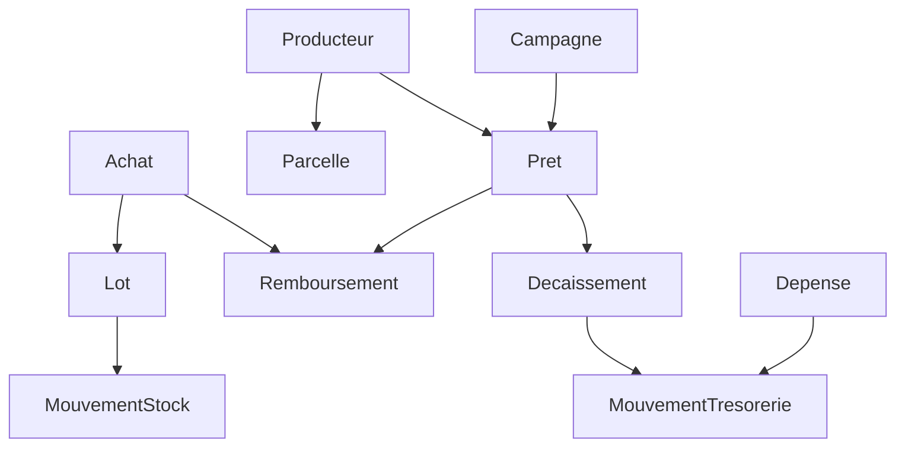

# Modèle de données — phase 1

Projet de schéma à valider pendant la semaine 1. Conventions : `docs/DECISIONS.md`
(D3 UUID, D4 FCFA entiers et grammes, D5 registres immuables, D8 noms français).

Légende : 📱 = créable hors ligne sur l'appli terrain (clé UUID v7 fournie par le
téléphone) · 🔒 = registre immuable (jamais `UPDATE` ni `DELETE`, correction par
contre-passation).

## Référentiels

| Table | Colonnes principales | Remarques |
| --- | --- | --- |
| `users` | nom, telephone, email, role, actif | rôles : `direction`, `agent`, `agronome`, `comptable`, `investisseur`, `admin` ; `role` vide = aucun droit ; pas de suppression, on désactive |
| `zones` | nom, actif | région / département de collecte |
| `villages` | zone_id, nom, lat, lng, actif | nom unique par zone ; lat/lng en `DECIMAL(10,7)` |
| `produits` | code (`anacarde`, `karite`, `tomate`…), nom, actif | pas de colonne `unite` : tout se pèse, en grammes (D4) — modifié le 2026-09-28 |
| `campagnes` | code (`2026-2027`), produit_id, debut, fin, statut, prix_officiel_kg_fcfa | statut : `preparation`, `ouverte`, `cloturee` ; code unique par produit ; **une seule ouverte par produit** ; prix vide tant que non annoncé |
| `magasins` | nom, village_id, capacite_g, actif | capacité en **grammes** (D4), saisie en kg — remplace `capacite_kg` le 2026-09-28 |
| `points_collecte` | nom, village_id, actif | nom unique par village |

## Producteurs et parcelles

| Table | Colonnes principales | Remarques |
| --- | --- | --- |
| `producteurs` 📱 | id (UUID v7), code (carte QR), nom, prenoms, sexe, annee_naissance, telephone, numero_mobile_money, operateur_mm, piece_type, piece_numero, photo, village_id, groupe_id, consentement_at, consentement_par, cree_par, actif | `code` = `LYP-000001`, attribué par le **serveur** (table `compteurs`), jamais par le téléphone ; le QR ne contient que lui. Téléphones stockés en 10 chiffres. Pièce identique = **refus** (index unique) ; téléphone / Mobile Money identique = **alerte à confirmer**, confirmation journalisée (`doublon_confirme`). Pas de fiche sans consentement. Photo sur le disque **privé**. |
| `compteurs` | nom, valeur | numéros lisibles attribués par le serveur, sous verrou de ligne ; pas de trou si la création échoue |
| `groupes_producteurs` | nom, village_id, responsable_id, actif | nom unique par village ; responsable = producteur du village |
| `parcelles` 📱 | id (UUID v7), producteur_id, nom, contour, surface_m2 (calculée), **contour_origine** (`import` : fichier au bureau ; `gps` : relevé en marchant, sem. 9), produit_id, annee_plantation, nb_arbres, sol, acces_eau, cree_par, actif | `contour` = géométrie GeoJSON (Polygon/MultiPolygon, WGS84) ; `surface_m2` recalculée par le modèle à chaque changement de contour, **non affectable** ; sans contour : vide (« non relevée »). Culture = `produit_id` (au lieu de `culture` texte). |

## Prêts

| Table | Colonnes principales | Remarques |
| --- | --- | --- |
| `prets` | id (UUID v7), reference (`LYPR-000001`), producteur_id, campagne_id, montant_fcfa, forme (`especes`, `mobile_money` ; `intrants`, `mixte` en semaine 5), prix_reference_kg_fcfa, grammes_attendus, echeance, statut, **validations_requises**, **partie_liee**, **accord_ecrit**, motif_refus, cree_par, valide_at, motif_cloture | statut aujourd'hui : `demande`, `valide`, `refuse`, `decaisse` (les autres avec les remboursements) ; `valide_par` remplacé par la table `validations_pret` (2026-10-17) ; pas d'intérêt (question 4) ; kilos attendus = **estimation** au prix de référence (question 3) |
| `validations_pret` 🔒 | pret_id, user_id, created_at | une ligne par validation ; unique (prêt, personne) ; aucune par l'auteur ; 2 au-dessus du seuil **ou si le seuil n'est pas défini**, 1 sinon |
| `pret_parcelle` | pret_id, parcelle_id | hectares financés = somme des surfaces relevées ; plafond par hectare vérifié sur elles |
| `decaissements` 🔒 | pret_id, montant_fcfa, mode, reference_paiement, compte_id, date_decaissement, justificatif, mouvement_id, cree_par | chaque tranche = une sortie de trésorerie (nature `decaissement_pret`) ; Σ tranches non contre-passées ≤ montant ; espèces : caisse + reçu signé ; Mobile Money : compte Mobile Money + référence |
| `remboursements` 🔒 | pret_id, type (`especes`, `nature`, `contre_passation`), montant_fcfa (**signé** : une contre-passation est négative), grammes, prix_kg_fcfa, regle_valorisation (figée), achat_id (si nature), mouvement_id (si espèces), date_remboursement, motif, annule_id, cree_par | **restant dû = remis (argent + intrants) − Σ montant_fcfa**, jamais négatif (le service plafonne / refuse) ; en kilos : valorisés selon le paramètre `regle_remboursement_nature` (question 3), **sans règle choisie : refus** ; prêt `solde` quand tout est remis et remboursé |

## Intrants

| Table | Colonnes principales | Remarques |
| --- | --- | --- |
| `intrants` | nom, unite, prix_unitaire_fcfa | engrais, sacs, bâches |
| `mouvements_intrants` 🔒 | intrant_id, magasin_id, type (`entree`, `distribution`, `perte`, `ajustement`), quantite, pret_id, date, annule_id | une distribution à crédit alimente le prêt en nature |

## Achats et stock

| Table | Colonnes principales | Remarques |
| --- | --- | --- |
| `achats` 📱 | id (UUID v7), reference (`ACH-000001`), campagne_id, lot_id, fournisseur_type (`producteur`, `pisteur`, `cooperative`), producteur_id, pisteur_id, fournisseur_nom, point_collecte_id, date_achat, lat, lng, poids_brut_g, tare_g, poids_net_g, humidite_pour_mille, kor_centieme_lbs, grainage_noix_kg, prix_kg_fcfa, montant_fcfa, pret_id, **grammes_rembourses**, **montant_especes_fcfa**, compte_id, mouvement_id, photo_pesee, statut (`a_valider`, `valide`, `refuse`), cree_par, valide_par, valide_at, motif_refus | montant = `intdiv(net × prix + 500, 1000)` ; prix < prix officiel de la campagne ⇒ refus ; au-dessus du seuil **ou seuil non défini** ⇒ validation par un autre, et stock + remboursement + paiement **à la validation** ; `produit_id` retiré (celui de la campagne) ; `agent_id` = `cree_par` |
| ↳ `achats.poids_source` | `balance` \| `manuel` \| null | source du poids brut (balance Bluetooth ou saisie à la main) : **trace, pas un blocage** ; null = achat d'avant ou appli qui ne l'envoie pas ; fixée par le téléphone, revalidée par le serveur (valeur inconnue ⇒ opération rejetée) |
| `pisteurs` | nom, telephone, actif | vendeurs seulement ; **commission : question 6** (pas de `taux_commission` pour l'instant) |
| `lots` | code (`LOT-00001`), produit_id, campagne_id, magasin_id (d'origine), statut (`ouvert`, `ferme` ; `vendu`/`transforme` en phase 2), description, cree_par | stock par magasin = Σ mouvements |
| `mouvements_stock` 🔒 | lot_id, magasin_id, type (`entree_achat`, `transfert_sortie`, `transfert_entree`, `perte`, `ajustement_inventaire`, `contre_passation` ; `sortie_vente` en phase 2), grammes (signé), date_mouvement, motif, achat_id, lien (transfert), annule_id, cree_par | stock d'un lot = Σ grammes ≥ 0 par magasin ; l'entrée d'un achat ne se contre-passe pas depuis le stock |
| ~~`inventaires`~~ | — | **remplacée (2026-10-31)** : un inventaire saisit le poids compté ; l'écart devient un mouvement `ajustement_inventaire` motivé (le poids compté est dans le motif) |

## Reventes (phase 2, ajoutée le 2026-12-05)

| Table | Colonnes principales | Remarques |
| --- | --- | --- |
| `ventes` | id (UUID v7), reference (`VTE-000001`), campagne_id, lot_id, type_acheteur (`exportateur`, `grossiste`, `autre`), acheteur_nom, date_vente, poids_net_g, prix_kg_fcfa, montant_fcfa, qualite_acceptee, facture, statut (`a_valider`, `valide`, `refuse`), cree_par, valide_par, valide_at, motif_refus | montant = `intdiv(poids × prix + 500, 1000)` ; au-dessus du seuil `seuil_validation_vente_fcfa` — **ou seuil non défini** — validation par un autre avant que le stock ne sorte ; un lot dont le stock tombe à 0 (tous magasins) passe `vendu` |
| `encaissements` 🔒 | vente_id, montant_fcfa (**signé**), compte_id, date_encaissement, reference_paiement, mouvement_id, motif, annule_id, cree_par | **stade séparé de la vente** (cahier §7) : l'acheteur peut payer à la livraison ou à terme (question 15, non tranchée) ; reste à encaisser = montant − Σ montant_fcfa, jamais négatif |
| `mouvements_stock` | + colonne `vente_id` (nullable) | sortie d'une vente (`sortie_vente`), au même titre que l'entrée d'un achat ; ne se contre-passe pas seule, elle suit la vente |

**Limite connue.** La marge par lot (`App\Services\Ventes::margeLot()`) ne compte que les achats et les ventes : les frais de transport, taxes et commissions à la revente ne sont pas rattachés au lot (pas de `lot_id` sur `depenses`). La marge affichée est donc une borne haute, et l'écran le dit.

## Apports de campagne (phase 2, ajoutée le 2026-12-12)

| Table | Colonnes principales | Remarques |
| --- | --- | --- |
| `apports` 🔒 | investisseur_id (nullable = apport de LY), campagne_id, montant_fcfa (**signé**), date_apport, motif, mouvement_id, annule_id, cree_par | contrat art. 5 (compte dédié) et art. 9 (apport de LY facultatif) ; un apport hors du compte dédié de la campagne est refusé |
| `valorisations_stock` 🔒 | campagne_id, poids_g, offre1_fournisseur / offre1_date / offre1_prix_kg_fcfa, offre2_… (idem), valeur_retenue_fcfa, motif, cree_par | contrat art. 11.3, question 32 : valeur du stock invendu retenue par la direction seule à partir de **deux offres écrites de deux fournisseurs différents** ; la plus récente d'une campagne fait foi, l'historique reste |
| `decisions_plafond` 🔒 | producteur_id, campagne_id (nullable), plafond_propose_fcfa (nullable), raison_proposition, plafond_retenu_fcfa, motif, donnees (JSON : synthèse et prêts pris en compte), calcule_at, cree_par | question 35 : décision de la direction sur le plafond ; un motif est exigé si elle diffère de la proposition ; jamais au-dessus du plafond des Paramètres ; trace seulement (non appliquée automatiquement aux prêts) |

**Partage du résultat (contrat art. 10 à 14).** Aucune table : tout est recalculé. `App\Services\PartageResultat` (pur, entiers) applique l'art. 12 (40 % investisseurs / 60 % LY, quote-part au prorata investi), l'art. 13 (perte au prorata des apports, LY sur son apport propre, exception 13.4 = décision de la direction) et reprend les deux exemples de l'art. 14 en tests. `App\Services\ResultatCampagne` lit les registres : recettes = encaissements de ventes ; charges = achats validés + dépenses payées non exclues (10.3) ; valeur du stock invendu = donnée par la direction (11.3). Résultat **provisoire** : affiché à la direction et à la comptabilité seulement (`/resultat`), pas aux investisseurs (question 32).

## Trésorerie et dépenses

| Table | Colonnes principales | Remarques |
| --- | --- | --- |
| `comptes_tresorerie` | nom, type (`caisse`, `banque`, `wave`, `orange_money`, `mtn_momo`, `moov_money`), titulaire_id (caisse d'agent), campagne_id (compte dédié, art. 5), actif | **pas de colonne solde** |
| `mouvements_tresorerie` 🔒 | compte_id, sens (`entree`, `sortie`), montant_fcfa, nature, date_operation, libelle, reference_externe, lien, source_type, source_id, annule_id (unique), motif, cree_par | solde = somme ; virement = deux mouvements de même `lien` ; écrits **seulement** par `App\Services\Tresorerie` (verrou du compte, jamais de solde négatif) ; contre-passation d'un virement = ses deux jambes |
| `categories_depense` | nom, code_syscohada, exclue_fonds_campagne, actif | art. 10.3 du contrat : refusée sur un compte de campagne et sur une dépense rattachée à une campagne |
| `depenses` 📱 | id (UUID v7), categorie_id, compte_id, montant_fcfa, date_depense, beneficiaire, description, justificatif (disque privé, obligatoire), campagne_id, parcelle_id, statut (`a_valider`, `payee`, `refusee`, `annulee`), cree_par, valide_par, valide_at, motif_refus, mouvement_id | au-dessus du seuil — **ou seuil non défini** — validation par une autre personne, l'argent sort à la validation ; `lot_id`, `pret_id` viendront avec leurs tables |
| ~~`avances_agents`~~ | — | **remplacée (2026-10-10)** : une avance est un virement de nature `avance_agent` vers la caisse de l'agent (compte avec titulaire) ; le **reste à justifier est le solde de sa caisse**, sans table à tenir d'accord |
| `lignes_budget` | campagne_id, poste (`achats`, `prets`, `categorie`), categorie_id, montant_fcfa (prévu, ≥ 0), note, motif_modification (facultatif, entre au journal avec l'ancien et le nouveau montant), cree_par, modifie_par | budget de campagne (cahier §8), **pas un registre** : une ligne se modifie (journalisée), jamais sur une campagne clôturée ; un poste une fois par campagne ; catégorie exclue par l'art. 10.3 refusée. **Le réel n'est pas stocké** : `App\Services\Budgets::suivi()` le recalcule — dépenses payées rattachées à la campagne, argent payé sur les achats validés (pas la part retenue sur un prêt), argent décaissé sur les prêts (hors contre-passés ; les intrants remis sont déjà comptés à leur achat) |

## Transverse

| Table | Colonnes principales | Remarques |
| --- | --- | --- |
| `confirmations_sms` | producteur_id, objet_type (`achat`, `decaissement`, `remboursement`), objet_id, telephone, message, statut (`en_attente`, `envoye`, `echec`), pilote, envoye_at, erreur | preuve envoyée au producteur ; **une par opération** (unique objet_type + objet_id) ; écrite dans la transaction de l'opération, envoyée **après le commit** (job `EnvoyerConfirmationSms`, `afterCommit`) ; pas de téléphone ⇒ pas de ligne ; achat à valider ⇒ SMS seulement à la validation. `reponse` retirée (pas de réponse du producteur en phase 1) |
| `journal_activite` 🔒 | user_id, action, objet_type, objet_id, avant, apres, ip, appareil, at | qui a fait quoi |
| `synchronisations` | appareil_id, user_id, recu_at, nb_operations, nb_acceptees, nb_deja_recues, nb_rejetees | un appel à `POST /api/sync` ; `erreurs` remplacée par `operations_recues.motif` |
| `photos_terrain` | **id** (UUID v7 du téléphone), user_id, appareil_id, chemin (disque privé), mime, taille_octets, prise_at, lat, lng, recu_at | reçues par `POST /api/photos`, **à part** des opérations, idempotent ; référencées par `achats.photo_pesee` (peut arriver après l'achat) et comme justificatif d'une dépense terrain (doit arriver avant : l'appli l'envoie d'abord) |
| `visites` 📱 | **id** (UUID v7 du téléphone), parcelle_id, date_visite, lat, lng (position à l'enregistrement, facultative), pratiques (JSON : codes de `App\Enums\PratiqueCulturale`), observations, cree_par, cree_at (heure du téléphone), timestamps | visite de parcelle (cahier §4) : un constat, ni argent ni poids ; créée seulement par `/api/sync` (type `visite`) ; refusée si vide (ni pratique, ni observation, ni photo), datée dans le futur, sur une parcelle inconnue ou désactivée ; la parcelle peut avoir été relevée dans le même envoi |
| `visite_photo` | visite_id, photo_id | photos d'une visite ; elles doivent être arrivées **avant** la fiche (comme le justificatif d'une dépense) et avoir été envoyées par le même utilisateur. Une photo de visite est visible de qui voit les visites (l'agronome), pas les autres photos |
| `notifications` | id (UUID), type, notifiable (morph), data (titre, texte, url, categorie `a_valider` / `valide` / `refuse` / `alerte`), read_at | table standard de Laravel : la liste lue dans l'application (cloche de l'en-tête, `/notifications`). Écrite par `App\Services\Notifications::envoyer()`, seul point d'entrée, **après le commit** (`AvisLy::afterCommit`), en file d'attente. Déclencheurs actuels (`App\Observers\DeclencheursNotifications`, en lecture seule) : achat, dépense, prêt, vente créés « à valider » → ceux qui ont le droit de valider, sauf l'auteur ; passés à validé / refusé → l'auteur |
| `alertes_envoyees` | cle (unique), envoye_at | `App\Services\Alertes` (commande `notifications:alertes`, chaque jour à 7 h) : une alerte ne part qu'une fois. Clés : rappel des saisies en attente depuis plus de 48 h (par personne et par jour), prêts en retard (par jour, définition de `FiabiliteProducteur`), poste de budget dépassé (par poste et montant prévu : une révision réarme), écart de poids (par lot et valeur) et sauvegardes (par jour), repris du rapport « Alertes » de `Rapports`. Avis immédiat aussi (`DeclencheursCampagne`) : campagne ouverte, prix officiel annoncé ou changé → qui saisit des achats. Destinataires : qui a le droit de voir l'écran concerné ; texte du push générique (écran verrouillé) |
| `abonnements_push` | user_id, canal (`web` : navigateur, Web Push VAPID ; `fcm` : appli terrain, Firebase), destination (adresse ou jeton), empreinte (sha256, unique), cle_p256dh, cle_auth, appareil, dernier_envoi_at, echecs | un appareil qui reçoit le « push ». Repris par un autre utilisateur ⇒ réattribué. Appareil disparu (404 / 410 / `UNREGISTERED`) oublié tout de suite ; 5 échecs de suite ⇒ oublié ; une panne du serveur n'est pas comptée. Sans clés VAPID, rien ne part vers les navigateurs ; Firebase en pilote `journal` par défaut (rien ne part, comme les SMS) |
| `operations_recues` | **uuid** (clé primaire = UUID du téléphone = id de ce qui est créé), type (`producteur`, `achat`, `parcelle`, `depense`, `visite`), synchronisation_id, appareil_id, user_id, statut (`accepte`, `rejete`), motif, cree_at (heure du téléphone), recu_at (heure du serveur) | clé d'idempotence : acceptée ⇒ un renvoi répond `deja_recu` sans rien refaire ; rejetée ⇒ renvoyable corrigée avec le même UUID |
| `personal_access_tokens` | (Sanctum) tokenable, name (= appareil), token, abilities, last_used_at, expires_at | un jeton par téléphone ; révoqué à la déconnexion ; un compte désactivé est refusé même avec un jeton valide |
| `parametres` | cle, valeur | clés connues du code (`App\Enums\CleParametre`) ; **pas de valeur par défaut** : non défini ≠ 0, le code applique la règle prudente. Sem. 10 : `seuil_alerte_ecart_poids_pour_mille` (non défini ⇒ **tout** écart est signalé) |

Rapports (sem. 10, `App\Services\Rapports`) : **aucune table**. Restant dû, stock, soldes et
écarts sont recalculés à chaque affichage à partir des registres. Écart de poids d'un lot =
pertes + ajustements d'inventaire + corrections ; une vente (sortie de phase 2) n'est pas un
écart.

## Invariants à tester dès la semaine où la table naît

1. Restant dû d'un prêt = `montant_fcfa − Σ remboursements` et n'est jamais négatif
   (un trop-perçu devient un crédit producteur explicite, pas un nombre négatif).
2. Stock d'un lot = `Σ mouvements_stock.grammes` ≥ 0.
3. Solde d'un compte = `Σ entrées − Σ sorties` ; une caisse ne passe jamais en négatif.
4. Un achat enregistré deux fois avec le même UUID = un seul achat.
5. `valide_par ≠ cree_par` sur tout ce qui se valide.
6. Aucun `UPDATE`/`DELETE` possible sur une table 🔒 (le modèle lève une exception).
